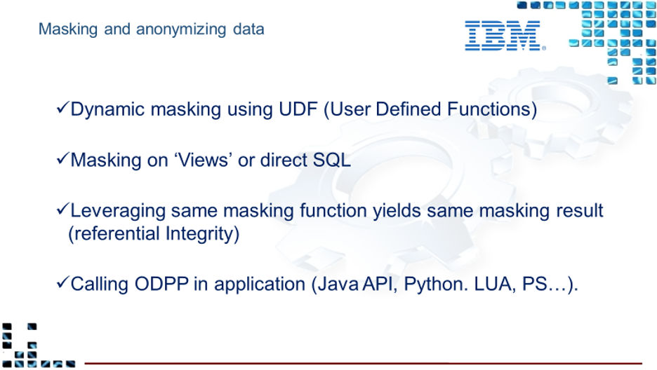

InfoSphere Optim Overview

### Optim Product Management Team

**Product Management Manager**

John Kwon

**Sales, business, marketing**

Amod Upadhye - Assistant Product Manager

Sunil Abraham - Product Manager

**All Technical, Development and Partners**

Vishwas Balakrishna - Product Manager

# Family of Products

## IBM Optim Test Data Management (TDM)

IBM Optim Test Data Management Solution offers proven technology to optimize and automate processes that create and manage data in non-production (testing, development, and training) environments. Developers and quality assurance testers can create realistic, “right-sized” test databases, create targeted test scenarios, protect privacy, and compare “before” and “after” test results with speed and accuracy.

Creates targeted test scenarios to force error and boundary conditions by creating realistic, “right-sized” test databases and targeted test scenarios.

Almost always is accompanied by Optim Data Privacy to protect privacy by masking sensitive columns and being able to compare “before” and “after” values.

- Automates test result comparisons to identify hidden errors
- Refreshes and maintains “production-like” test environments
- Shortens iterative testing cycles and accelerate time to market

Test data management capabilities delivered through Optim TDM help control the size of development and testing environments. By eliminating excess data volume, you can reduce storage requirements, trim costs and improve testing efficiency. You can also create any number of purpose-built development, test and training databases to satisfy specific requirements, improving both coverage and accuracy. Streamlined test databases are also easier to manage and maintain, so you can speed iterative testing cycles and shorten the time necessary to deploy new software functions.

InfoSphere Optim Test Data Management helps improve every stage of the application testing process by providing the data you need.

### Protect privacy in development, testing and training environments

Optim TDM offers various methods for masking test data to protect privacy and support regulatory compliance initiatives.

Optim TDM provides comprehensive data masking techniques, including built-in lookup tables and prepackaged routines that support transforming complex data elements, such as credit card numbers and email addresses. You can also incorporate custom transformation routines based on site-specific requirements.

### Create test scenarios

Another way to optimize your testing environment is to create targeted test scenarios. Optim TDM includes comprehensive relational editing capabilities that make it easy to compose this special data. It also provides capabilities for browsing and editing data in its relational context across multiple tables, which offers a better way to envision the data relationships. A powerful undo capability helps you reverse an unlimited number of editing changes, and a sophisticated audit facility tracks changes and saves details for review by authorized users.

### Automate data comparisons and analyze results

The ability to analyze and validate test results is critical for ensuring application quality. Database size and complexity significantly increase the effort involved in examining test results. After a test run, Optim TDM analyzes the before and-after images of the data, automatically detecting any differences and presenting the results in a concise report, saving countless hours of manual inspection.

Optim TDM enhances virtually all phases of application testing. An intuitive, online interface and full-function browse utility help eliminate time-consuming, error-prone, table-by-table comparisons. Optim TDM not only identifies the expected database changes, but also uncovers differences that might otherwise go undetected. Application defects that are hidden or difficult to trace can be identified quickly and resolved in a fraction of the time.

### Streamline test data delivery

As organizations work to shorten iterative test cycles and accelerate time-to-market, testers and developers need access to on-demand test data. Organizations are embracing agile development, which relies on agile testing. Agile testing requires continuous access to test data to run tests and builds, and the ability to run them continuously until the test requirements are satisfied.

InfoSphere Optim supports this requirement by enabling testers and developers to access and refresh test data that has already been masked and provisioned by DBAs. On-demand test data access and refresh improve operational efficiency while providing more time to test. You can implement a customized test data management process that meets project or enterprise testing goals through a flexible test data management workflow.

### Establish and enforce enterprise test data management policies and rules

Optim TDM provides a standard way to govern the test data management process and validate that, policies and standards are accepted throughout the lifecycle. Optim TDM enables people, processes and technology to come together to create more value.

### Support your enterprise environments

Optim TDM provides a central data management solution supporting major enterprise databases, data lake houses and operating systems, including:

- IBM Db2® and IBM Informix® database servers
- Oracle
- Sybase
- Microsoft SQL Server
- IBM IMS™ database management system (DBMS)
- IBM Virtual Storage Access Method (VSAM)
- Teradata
- PostgreSQL
- Netezza®
- Microsoft Windows, UNIX, Linux and IBM z/OS® operating systems
- And many others

### Optim TDM Strengths

1. Optim identifies and extracts the complete business object, including the extract strategy.
        - Access definitions contain the tables access strategy, the DDL, and relationships. Essentially, everything a database needs to recreate the database tables in a test database.
2. Compare Utility
        - Optim Compare engine provides views on data between extract files and databases or hybrid data to confirm the existence or changes of the data for compliance, audit, or masking effectiveness purposes.
        - The default process verifies that extracted rows match production before any updates
3. Relation Edit Utility
        - Optim allows authorized users the ability to edit database tables to fit their testing needs
4. Relational Browse Utility
        - Optim enables the browsing of extract files and the data in all related tables.
5. Reports
        - Optim generates 2 types of html reports:
                1. Process reports for the operational team, i.e. what process just ran to archive the data, were there any errors.
                2. Consumption reports for license compliance, i.e. what fields were masked, how much data was extracted, etc
6. Performance
        - Optim performance can be tuned many ways. The best performance for database selection (reads) and database inserts and updates occur for natively supported databases

### More detail performance advantages due to Optim’s Natively supported RDBMS connection

1. Optim Access via Show Steps
2. Index Analysis Report
3. Database Connection control
4. Database Commit point control
5. Ability to manage number of keys accessed per database fetch
6. Ability to control Key vs scan access
7. Ability to control traversal trough RDBMS via duplicate relationships
8. Ability to control buffer size per connection
9. Ability to Restart a process
10. Support for automatic RDBMS loader vs Insert
11. Ability to control DML: Insert, Update, Both
12. Ability to lock or delete all data before update process
13. Ability to run externalized masking function in RDBMS user defined functions which can be 100s of times faster than normal inserts

:::note 

1. The recommended IBM product is the InfoSphere Optim Test Data Management Enterprise Edition (TDM EE) terabyte license unless instructed otherwise. This part comes with the full capabilities of the Test Data Management and the Data Privacy solutions.
2. Marketing would say that Optim can access mainframe data and distributed data using the same tool and Optim engine. This is ONLY true when Optim on Windows or Linux connects to a mainframe middleware server such as Classic federation or DVM. The use of Classic federation has virtually disappeared due to the lack of customers using it and the notion that DVM running on the mainframe has also dwindled since we have found that very few if any customer today mixes mainframe data and distributed data together in one Optim extract file. The best practice is to use Optim on Windows or Linux for data that resides on Windows or Linux or the cloud and use Optim on the mainframe when non Db2 data resides on the mainframe.
3. The Optim zOS product runs natively on the mainframe using 3270 mainframe green screens. There is no interaction between or synergy between Optim on Distributed and Optim on the mainframe which can be viewed as a negative aspect depending on the perspective.
4. Latest Release is 11.7 Fix Pack 3 includes OS, versions and DB support. 64 bit Linux support for Optim for next year.
5. Attunity Connectors for mainframe: Current customers are using the mainframe middleware (Attunity Connect) without any IBM support or fixes.
6. Full IBM support for Optim Test Data Management/ Data Privacy and Archive.
7. Future concern: Unicom is the Optim support arm. The expiration of the IBM contract with Unicom and Optim will end of 2025. This needs to be re-negotiated, can’t sell a customer a multiple year sale for Optim in 2025 if new contract is not signed.
8. Future concern: Classic Federation is supported currently but Classic Data Architect (CDA) which in discussion to be shut down, this means Classic Federation middleware will have to stop.
:::

## IBM Optim Data Privacy

Optim Data Privacy provides extensive capabilities to effectively mask sensitive data across nonproduction environments, such as development, testing, QA or training.

Optim Data Privacy provides a variety of transformation techniques that substitute sensitive information with realistic, fully functional masked data. The contextually accurate masking capabilities help masked data retain a similar format to the original information.

It allows the customer to take the necessary steps to protect privacy, while still providing the necessary “realistic” data for use in development, testing, training, or other legitimate business purposes.

Optim Data Privacy enables the customer to…

- Protect the privacy of confidential data across non-production environments
- Apply predefined masking techniques to speed time to delivery
- Preserve the integrity of the data, while protecting privacy
- Improve flexibility for masking data in existing non-production databases
- Support privacy regulations and corporate governance standards

### Optim Data Privacy Strengths

Optim Data Privacy along with Optim TDM (Optim TDM Enterprise edition) TDM EE provides for the following…

Full Test Data Management/Data Privacy Functionality

- Automatic and Easy Subsetting (masking is 100% integrated with Optim Test Data Management
- Subsetting is automatic, does not rely on SQL skills
- Automatic complete business object”
- 'random select' or Every “nth” row
- Automatic Relationally intact subset (Relationships are automatically used in Optim
- Browse facility
- Edit facility
- Compare facility
- Test Data Fabrication ability using Optim Test Data Fabrication
- Unstructured Data masking using Data Privacy for Unstructured Data (DPU) can run from an Optim Test Data Management Column maps
- Data Privacy Providers
  - Externalize masking to custom programs
  - Pre-defined user defined functions
  - Ability to mask data with SQL such as Update table..masking routine
  - Ability for dynamic or real time masking
- Java enabled APIs to allow masking to create 'modern' services in the cloud
- Optim Data Privacy Provider Library (ODPP)
  - Set of out-of-the-box privacy algorithms referred to as “providers”
  - Can be extended to include user-written providers
  - Ability for dynamic or real time masking
  - Is used in other IBM products and customer applications
  - Java Based Hadoop User Defined Functions
  - Provides dynamic invocation of masking services
  - Consistent behavior across platforms
  - Written in cross-platform, ANSI C/C++, Java
  - Interfaces with other languages that support the C and Java calling conventions
  - Provides platform abstraction services

### Masking - Part of both Optim Test Data Management Enterprise Edition (TDM EE) and the Optim Data Privacy Solution

Optim Data Privacy Solution helps protect sensitive data privacy by applying masking routines to de-identify data, which facilitates testing while keeping sensitive data secure. Sensitive data may include Personally Identifiable Information (PII), Protected Health Information (PHI) and information that falls under the Payment Card Industry Data Security Standard (PCI DSS). It can also compare the data from before-and-after testing with speed and accuracy to help testers and developers pinpoint errors or defects.

IBM _Optim_TM Data Privacy Solution provides numerous built-in masking functions. From flexible lookup functions, to intelligent, context-aware data masking functions for generating valid credit card numbers, or even national identifiers for various countries, Optim Data Privacy Solution allows users to effectively privatize sensitive information in their test data. Thereby having realistic test data for development and testing environments without violating Data Privacy regulations.

In addition to numerous built-in masking functions provided by default, Optim also allows users to design their own customized masking functions. For cases where a specific country’s national identifier is not covered by Optim built-in masking functions, or when the site requires special processing during the data masking procedure, users can make use of the following alternatives to help masking your sensitive data:

- Column Map Procedure
- Customized Exit routines for Column Maps

### ODPP Optim Data Privacy Provider Libraries

The Optim masking functions have been externalized so that some masking functions can be called from a program, meaning from a database User Defined Function (UDF) or DataStage or a client’s home grown program. Installing the Optim Data Privacy Providers is done without installing other Optim components such as the Optim Workstation, Server and the Optim Database directory.

Dynamic masking is often considered masking on the glass or paper meaning the data is not masked at the source but more at the end point of the data chain.  This could be either a user interface or a report.  It could even be used when moving the data to a reporting database.

:::note
1. The Optim Data Privacy Solution is rarely sold alone as it does not have any test data management (TDM) functionality and is used for a very small use case. Consult the client team for the rationale to leave out the full TDM/DP functionality of the Optim solutions.
2. Full IBM support for ODPP and UDF using the Data Privacy Providers within or outside of Optim Test Data Management/ Data Privacy and Archive solutions.
:::

## IBM Optim Data Growth Solution and Application Retirement Solution

IBM InfoSphere® Optim™ Archive and the Optim Decommissioning/Application Retirement solutions (same product, different Part number) is a scalable solution that can help your organization manage and support database archiving strategies. The solution can also help you control growing data volumes and associated storage costs while improving application performance and minimizing risks associated with data retention and compliance. Whether applied to packaged or custom applications or data warehouse environments, InfoSphere Optim Archive offers benefits to both IT groups and business units helping you intelligently archive and manage historical data throughout its lifecycle.

Top Five Needs Addressed:

1. Improved database / application performance
2. Increased database / application availability
3. Reduced infrastructure costs (servers, storage)
4. More easily meet security & regulatory compliance requirements (retention management)
5. Rapidly respond to audit and legal discovery requests

In addition to Why IBM Optim Archive or Data Growth Solution, Optim Application Retirement provides for the following benefits:

- Budget: Reduce hardware, software, human resource and infrastructure expenses
- Optimization: Reclaim IT assets and resources for other business purposes
- Business risk: Reduce infrastructure and operational complexity
- Service Level Agreements (SLAs): Shorten disaster recovery windows requirements

### Optim Archive and Application Retirement Strengths

Using Optim Data Growth Solutions, are able to address the following:

1. Reclaim capacity and help improve application performance and availability
2. Enables you to apply business policies to govern data retention, access and disposal
3. Archived data can be selectively restored to the production environment; for example, archived HR data for a past employee can be restored if that employee has returned
4. Policy-driven archive processes allow you to specify the business rules for archiving. Rules are commonly based on functional or legal requirements such as age, date transaction status, business unit or company
5. Maintaining reference data in an immutable format on a secure write-once, read-many (WORM) device
6. Enables you to protect archived business objects for regulatory compliance

### Selectively restore data

The restore request enables you to insert or load a subset of data from one or more archives. When the data model differs from that in the source (perhaps the archive was taken from an earlier version of your application), you can also provide additional instructions in the form of table and column maps. You control the boundaries of the process by defining these elements:

- Server on which to run the request
- Archives to be used for the restore
- Selection criteria for the subset of data to restore
- Method of restoring (load or insert)

### Search and restore

This restore mode enables you to select archives on the basis of data content.

The Optim solutions reference the catalog or Optim directory to identify candidate archives and search archive content to list archives before executing the process as in a selective restore process.

### Extract data and archive

An archive request enables you to extract a subset of data using an access definition that describes the complete business object and to store the extracted data in an archive file. You control the boundaries of the process by defining these elements:

- Server on which to run the request
- Variables to be used during processing
- Types of objects to be captured from the source database
- Archive and index files to create and compression options for those files
- Database resource utilization policy (concurrent connections)
- Access definition with complete business object (a copy is stored in the archive)
- Storage and retention policies
- Security for archived tables and columns (file access definition)
- Collections that are used to virtualize the archive
- E-mail address for notification in case of success or failure
- Delete strategy and timing

### Purge Source data

The delete request enables you to delete data from source databases using instructions in the access definition and data in an archive file. You control the boundaries of the process by defining these elements:

- Server on which to run the request
- Control file that is used for restarting the process and for audit purposes
- Database resource utilization policy (concurrent connections and table locking)
- Level of validation for the delete process (validate data model and compare data)

Optim identifies and archives the complete business object, including the extract strategy:
- (access definition with tables and relationships) and the purge strategy(delete tables). This information is stored in the archive, both because the data-driven engine requires it for processing and so that Optim can document and re-create the access definition in another Optim directory.

### Deferred delete

- Optim gives users ability to verify data before it is deleted or to include the delete processing in routine database maintenance tasks. This allows users to ensure the success and validate the results of the archiving process before deleting from production. In addition, this option provides the ability to schedule a delete process for an open window when the system activity is lower

### Retention policy and legal hold

- Retention manager implements retention policies and provides functionality for Optim and storage litigation holds to be applied across large groups of records.

Single immutable, compressed self-describing file

- Archive to compressed and immutable object stored in a single file. Holds data in a canonical form from which it can easily be moved to another Optim Directory and restored to virtually any database technology.

### Search and restore

- The restore mode enables you to select archives based on data content.
- The Optim solutions reference the catalog or Optim directory to identify candidate archives and search archive content to list archives before executing the process as in a selective restore process.

### Storage

- With Optim, you can implement tiered storage strategies to manage application data based on its evolving business value
- Optim allows you to choose the most effective access method based on business purpose, user convenience and cost

:::note 
1. The IBM InfoSphere® Optim™ Archive and the Optim Decommissioning/Application Retirement solutions is the same product with different names and part numbers. They have the same installation and prerequisites as the Optim Test Data Management Enterprise Edition.
2. Full IBM support for Optim Test Data Management/ Data Privacy and Archive Solutions.
:::

## Optim Archive Viewer

The new Optim Archive Viewer is used to access Optim Archive files. It increases the overall value of the Optim Archive solution 10X or more over the deprecated Optim Open Data Manager (ODM) method customers are using.

A current Optim customer today using Archive Viewer can reduce time, effort and resources by eliminating the need to create Optim Archive indexes. This means the reduction of many processing hours, CPU and labor.

In addition, since Optim Archive Collections are no longer needed, this reduces the 100s-to-1000s of potential Business Object, and Cognos ODBC and JDBC connections to be created and maintained.

Benefits of Modernization
  - Analytics: Query performance and query complexity are much improved
  - Archived data is open source accessible (Compressed Parquet, Spark)
  - Archived data can reside in Cloud storage and be accessed directly by ODBC or JDBC query
  - Defensible chain of custody is maintained from Prod to immutable Parquet files
    - Includes Parquet file Validation utility
  - Can coexist with ODM access to older AFs
    - … or client can migrate all Optim archived data to new Archive Viewer
    - We recommend keeping Optim AFs initially, for AF utilities if needed (eg Archive Split).
  - Can reduce storage requirements: less in Parquet vs ODM
  - Supports CLOB in search
  - No limitations on number of files in an Application (formerly, the Archive Collection was limited to 9999 files)
  - No Indexes can be / need to be defined
  - ANSI SQL 2003 (formerly SQL-92)

:::note 
1. Optim Archive Viewer created by our business partner Estuate is key to the Optim Archive solution for a net new sale, meaning, the customer does not already have the Optim Archive or Data Growth Solution license with Open Data Manager. Please see the note below, since you can use Optim to convert to CSV and then to Parquet, eliminating the need for Archive Viewer but keep in mind that Archive Viewer is an added sales opportunity and does hold many advantages as discussed below.
2. Customers who already have an Archive Open Data manager Server (ODM) is using it as middleware (runs on the mainframe or distributed platforms) to allow ODBC and JDBC connections to the Optim archive files. Due to the discontinuation of the Attunity Connect server, current Optim Archive customers must use (ODM) without any IBM support or fixes. The push is to trade up or replace ODM with the Optim Archive Viewer.
3. Watsonx.data integration –Parquet files using Archive viewer with archive files. No retentions, splits etc. Just need to view and keep the data. Just convert the archives to CSV using convert and load into watsonx.data lake house.
4. If watsonx.data is not in the sale, then propose Archive viewer.
5. Latest fix pack is FP6, As of 6/24/24 we have 8 customers , BOFA in trial waiting for major feature, segregation, (users and groups access in Spark). ODM allows query for data access with roles. High metastore in spark does not do this without another product. Struggling with issues, security and spark data source
6. Separate IBM part license
7. Full IBM support for Optim Test Data Management/ Data Privacy and Archive Solutions.
8. Product Manager Vishwas Balakrishna was the Estuate partner developer of Archive Viewer, his involvement is recommended.
:::

## IBM Optim Data Privacy for Unstructured Data (DPU) 

:::danger End of Life Warning
IBM Optim Data Privacy for Unstructured Data (DPU) is to be replaced by Extended Data Privacy (XDP) Summer 2024
:::

In order to maintain compliance, pass audits, mitigate risk, and protect your sensitive PII, PCI, and PHI data, Obfuscation and Masking must be applied across your enterprise. IBM Optim is the choice solution for obfuscating data contained in database systems but what about unstructured content? Is that in compliance? Without masking unstructured content how secure is your environment?

DPU that will help you ‘complete the compliance circle’ by obfuscating unstructured data such as PDF’s, images, web logs, MS Office documents, flat files, HL7 messages and more.

DPU can run standalone or in conjunction with IBM’s Optim data privacy solution to ensure data is masked consistently maintaining referential integrity across the entire enterprise for both Structured and Unstructured content.

Other

DPU can obfuscate unstructured data such as PDF’s, images, web logs, MS Office documents and more. DPU can run standalone or integrated with Optim data Privacy.

Works in Column map procedure, or exit or lua. Value passed to api or command line call return the value or act upon it in a convert request. Call during each record Optim processes or in a table after each table or when Optim finishes>> Not talking about Optim actions.

:::note 

1. Separate IBM license
2. New trade up part number from DPU to XDP. DPU 2.8 ends in July and replacement is Extended Data Privacy (XDP) 3.0
3. Normal IBM support number - L1 - IBM and L2/L3 - AB Martin
:::

## Extended Data Privacy (XDP) vs Unstructured Data Privacy (DPU)

- Was DPU now XDP
  - Why? It does more than unstructured data - much more/more connectors
- Change in pricing - much better when get to 100 TBS and to the PB level
  - we have scoped out 275 TB and 2 deals up to 4 PB
  - DPU was really high priced at that level
- Additional data sources - looking at new sources - look at XDP first - not Federation DB2 Server with Optim
- Built to run on additional platforms using Linux, UNIX or Windows (Windows Services for Linux)
- One deployment services multiple users as it is browser based
  - much better user support --> from Goldman Sachs and others
  - using Carbon 10 design method like CP4D
- Full Rest API capabilities version
- XDP is not able to process folder structures where DPU is.  However, multiple files can be processed in a single execution.
- Improved user interface - very cool looking etc
- Containerized with Red Hat using Podmon so run everywhere
  - have dockers version  and next step is to move to AWS to be a managed service
- Caveat: only about 8 out of 11 connectors are available in the XDP package, the rest over the next year or so, not all functionality on Linux.

## IBM InfoSphere Optim Test Data Fabrication

TDF rapidly generates high-quality test data while protecting privacy producing the data you need with rules-based fabrication.

The fabrication engine generates data by following rules that you set for it. You define the type of data, the volume of data, the relationships among different columns in databases, the resources for populating new data columns and the data transformations required.

Rule types include:

- Constraint rules: domains, mathematical functions,
- arithmetical relations, string relations, regulator expressions
- Knowledge base rules: drawn from existing data sources
- Analytics rules: value and pattern distributions, smart
- classifications, bundled or not
- Declarative transformation rules: constraints describing
- relations between targets and sources, bundled or not
- Programmatic rules: user-defined code/script functions
- that generate target values

:::note 

TDF No new sales, maintenance mode, no fixes, all POCs on hold . Talks in the works and trying to combine the TDF features into watsonx Synthetic data. Access to source code may be an issue. Watsonx.ai team to take over source code, need TDF source code : old code base, security, web server, klunky UI. Jordan Youngblood PM for watsonx Synthetic Generator.
:::

## IBM Virtual Data Pipeline (VDP)

Creates near instant virtual database copies with central management and self-service (roll back) refresh

:::note 

- VDP No new sales, maintenance mode. Google has severed relationship will support till 2029, exiting support for current customers. FP4 from Google is needed and in the works
- New product replacement in discussions: storage protect plus catalogic acquisition not real yet as of 7/01/24. Need equivalent data sources. 2 IBM sales teams would be involved, may be an ongoing issue.
:::

## IBM InfoSphere Optim Test Data Orchestrator

Test Data Orchestrator (TDO) enables agile developers and testers to rapidly build test data environments to help meet continuous testing requirements. It transforms simple designer input into dynamic, extensible coverage intelligence so you can quickly create test data environments — testing everything that matters, without overloading them with irrelevant data that slows you down. Test Data Orchestrator uses easy-to-define determining attributes, determining values and filter rules to calculate a comprehensive test data coverage matrix.

:::note 

TDO - Removed but still active. LeftShift/Orson support. Contact: [david.silverstone2@ibm.com](mailto:david.silverstone2@ibm.com)
:::